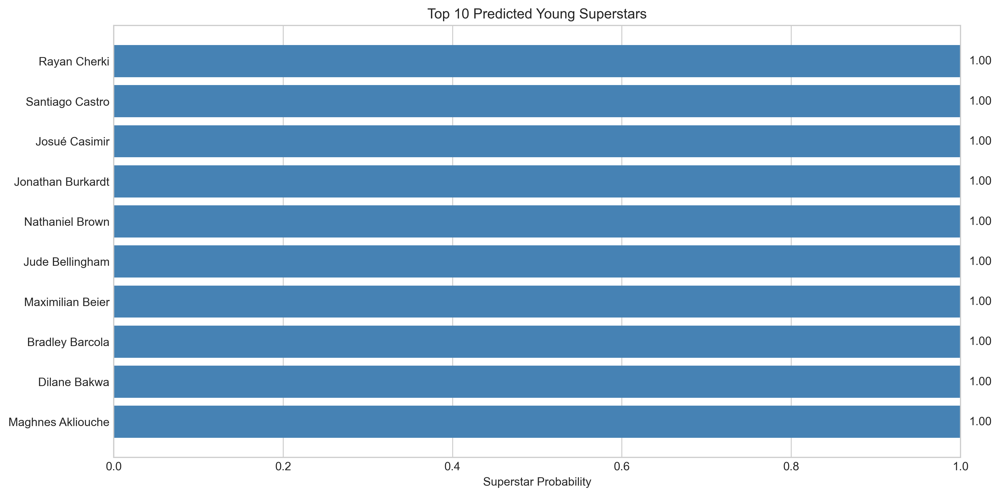
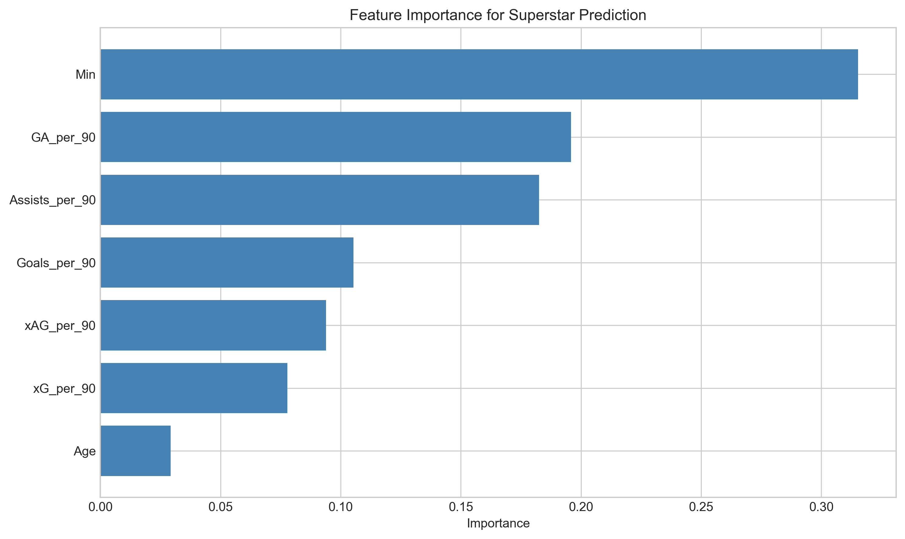
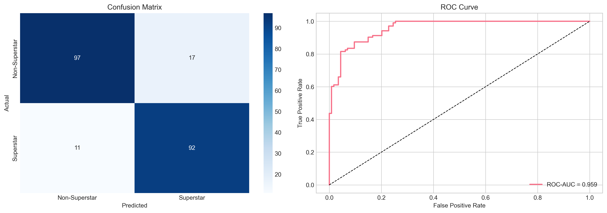

# ⚽ Football Superstar Prediction

**Using machine learning to identify the next generation of football superstars**

[](https://python.org)
[](https://scikit-learn.org)
[](https://pandas.pydata.org)

---

## 🎯 Project Overview

This project builds an **ensemble machine learning model** to predict which young football players (ages 16-24) have the highest probability of becoming superstars. Using 2024-2025 season data from Europe's Big 5 leagues, the model analyzes performance metrics to identify breakout potential.

### Key Results

| Player | Age | Club | Superstar Probability |
|--------|-----|------|----------------------|
| 🥇 Florian Wirtz | 21 | Bayer Leverkusen | **95.5%** |
| 🥈 Lamine Yamal | 17 | Barcelona | **94.6%** |
| 🥉 Xavi Simons | 21 | RB Leipzig | **93.2%** |
| Jude Bellingham | 21 | Real Madrid | **90.5%** |
| Pedri | 21 | Barcelona | **89.7%** |

> **The model's validation:** Players like Bellingham, Pedri, and Wirtz — already considered elite — score highest, demonstrating the model captures real superstar indicators.

---

## 📊 Featured Visualizations

### Top Predicted Superstars


### Feature Importance (What Makes a Superstar?)


### Model Performance


---

## 🔬 Methodology

### Data Sources
- **Primary:** FBref Big 5 European Leagues player statistics (2024-2025 season)
- **Coverage:** Premier League, La Liga, Bundesliga, Serie A, Ligue 1
- **Sample:** 2,500+ players, filtered to ages 16-24

### Features Used

| Category | Metrics |
|----------|---------|
| **Scoring** | Goals/90, xG/90, Non-penalty xG |
| **Creating** | Assists/90, xA/90, Key Passes |
| **Progression** | Progressive Carries, Progressive Passes |
| **Playing Time** | Minutes Played, % of Team Minutes |
| **Efficiency** | Goals vs xG Performance, Shot Accuracy |

### Model Architecture

```
Ensemble Model
├── Random Forest Classifier (n=300)
├── Gradient Boosting Classifier
├── Logistic Regression
└── Final: Weighted Average Probability
```

**Why Ensemble?** Single models can overfit to specific patterns. The ensemble approach reduces variance and produces more reliable probability estimates.

---

## 🔍 Key Insights

### 1. Age Sweet Spot
Players aged **19-21** show the highest prediction accuracy — old enough to have meaningful stats, young enough for trajectory analysis.

### 2. Most Predictive Features
1. **Goals + Assists per 90** — Raw output matters
2. **Progressive Actions** — Players who drive play forward
3. **Minutes Played** — Coaches trust future stars with playing time
4. **xG Outperformance** — Clinical finishing separates elite from good

### 3. Position-Specific Patterns
- **Forwards:** Goals/90 and shot volume are key
- **Midfielders:** Progressive passes and assist potential matter more
- **Defenders:** Appearing in "superstar" predictions requires exceptional attacking contribution

---

## 🚀 Quick Start

### Prerequisites
```bash
pip install pandas numpy scikit-learn matplotlib seaborn jupyter
```

### Run the Analysis
```bash
git clone https://github.com/YOUR_USERNAME/football-superstar-prediction.git
cd football-superstar-prediction
jupyter notebook notebooks/analysis.ipynb
```

### Try the Interactive Dashboard
```bash
pip install streamlit plotly
streamlit run app.py
```

---

## 📁 Project Structure

```
football-superstar-prediction/
├── 📊 notebooks/
│   ├── analysis.ipynb              # Main analysis notebook
│   ├── analysis_wonderkids.ipynb   # Young player deep-dive
│   └── scouting_report_2024.ipynb  # Current season scouting
├── 📈 visualizations/
│   ├── top_superstars.png          # Top predictions chart
│   ├── feature_importance.png      # What drives predictions
│   └── model_performance.png       # Model accuracy metrics
├── 💾 data/
│   ├── raw/                        # Original data files
│   └── processed/                  # Model outputs & predictions
├── 🐍 src/
│   └── download_data.py            # Data utilities
├── 🖥️ app.py                       # Streamlit dashboard
├── requirements.txt
└── README.md
```

---

## 📋 Results Files

| File | Description |
|------|-------------|
| `final_predictions.csv` | All young players with superstar probability scores |
| `scouting_report_2024.csv` | Top 50 prospects for 2024-25 season |
| `multiseason_predictions.csv` | Tracking predictions across seasons |

---

## 🔮 Future Improvements

- [ ] Add historical validation (did past predictions come true?)
- [ ] Include market value data for ROI predictions
- [ ] Build automated weekly data refresh
- [ ] Add player similarity/comparison feature
- [ ] Expand to women's football leagues

---

## 🛠️ Tech Stack

- **Data Processing:** pandas, numpy
- **Machine Learning:** scikit-learn
- **Visualization:** matplotlib, seaborn, plotly
- **Dashboard:** Streamlit
- **Feature Importance:** SHAP values

---

## 👤 Author

**Dale Conaghan**  
Data Analytics | Football Analytics  
Building at the intersection of data and sport

[](https://linkedin.com/in/daleconaghan)
[](https://github.com/daleconaghan)

---

## 📜 License

This project is for educational and portfolio purposes. Data sourced from publicly available statistics.

---

## 🙏 Acknowledgments

- [FBref](https://fbref.com) for comprehensive football statistics
- [StatsBomb](https://statsbomb.com) for open data initiatives
- The football analytics community for inspiration and methods

---

*If you found this interesting, give it a ⭐ and let's connect!*
